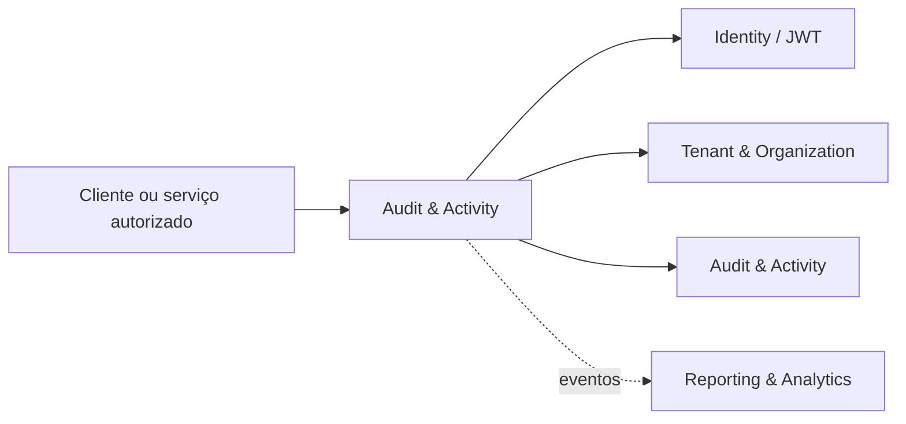

# Arquitetura e responsabilidades — Audit & Activity

## Propósito

Trilha imutável de auditoria administrativa, financeira, operacional e de segurança. O serviço declara a porta **4750** no ambiente atual.

## Boundary de responsabilidade

| Dentro do boundary | Fora do boundary |
| --- | --- |
| Persistência e regras do domínio de Audit & Activity | Regras pertencentes a outros owners |
| Validação de tenant, organização e autorização | Confiança em dados não assinados do cliente |
| Auditoria das mutações relevantes | Alterações diretas no banco de outro módulo |
| Contratos de integração versionados | Recalcular estados oficiais de outro owner |

## Topologia

## Dependências autorizadas

Eventos de todos os owners e comandos administrativos explicitamente autorizados.

Toda dependência deve utilizar o contrato transversal de comunicação, audience e scope mínimos. Nenhum módulo deve abrir acesso direto ao banco de outro módulo.

## Ownership e dados

Audit registra quem, quando, tenant, correlação, origem, motivo e alterações sem armazenar dados sensíveis desnecessários. Dados persistidos neste repositório devem possuir tenant/organization quando o domínio for multi-tenant, chaves únicas apropriadas, migrations versionadas e trilha de auditoria para alterações sensíveis.

## Evolução

Mudanças de boundary, ownership, estado ou contrato devem ser registradas em ADR antes da implementação. Mudanças incompatíveis exigem nova versão de contrato e janela de compatibilidade.

## Referências

[1]: https://github.com/operaon/audit "Repositório Audit & Activity"
[2]: https://github.com/operaon/api "API Gateway Operaon"
[3]: https://github.com/operaon/identity "Identity Operaon"
